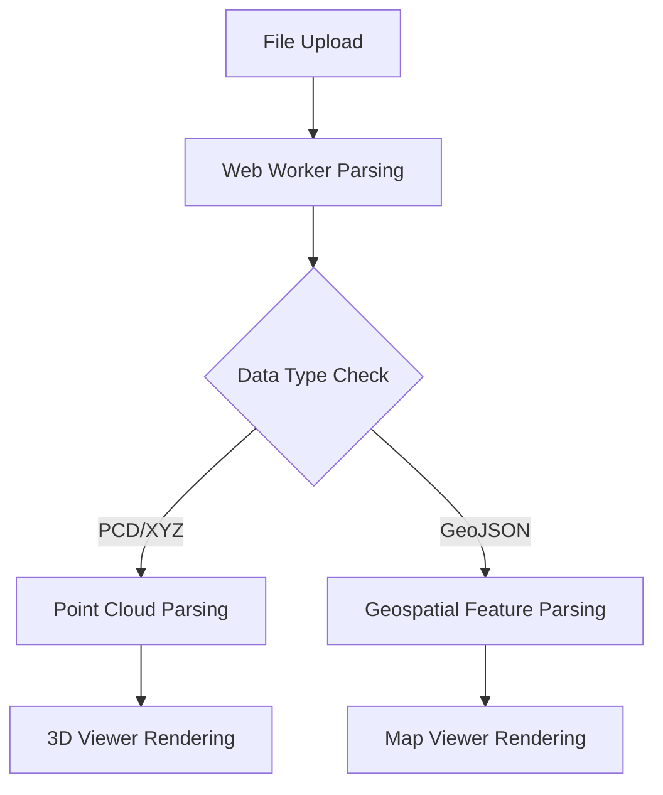

# Point Cloud and Geospatial Data Visualization System  

This document outlines the architecture of a visualization system designed to process and render large-scale point cloud datasets and spatiotemporal geospatial data. The modular frontend implementation supports cross-platform deployment while maintaining performance efficiency.  

---

## System Architecture Overview  

### Technical Stack  
- **Application Framework**: React with Material-UI components  
- **3D Rendering Engine**: Three.js  
- **Geospatial Visualization**: Leaflet integrated with Supercluster for clustering  
- **Background Data Processing**: Web Workers  

### Core Modules  
1. **Main Application Framework (`App.js`)**  
   - Manages file uploads and format validation  
   - Coordinates 3D/map view switching  
   - Maintains global application state  

2. **3D Point Cloud Viewer (`ThreeDViewer.jsx`)**  
   - Three.js scene configuration and camera controls  
   - Implements point cloud rendering with LOD optimization  
   - Provides coordinate system visualization and screenshot functionality  

3. **Spatiotemporal Map Viewer (`TimeSeriesMapViewer.jsx`)**  
   - Leaflet map instance management  
   - Time-series data animation
   - Properties filtering
   - Dynamic cluster rendering with zoom-level adaptation  

4. **Data Processing Layer**  
   - Web Worker-based file parsers (`fileParser.worker.js`)  
   - Supports PCD/XYZ (point clouds) and GeoJSON/JSON (geospatial) formats  
   - Progressive loading with real-time progress updates  

---

## Core Workflows  

### Data Loading Process  

---

## Key Technical Features  

### Dual-View Synchronization  
| **3D View**                  | **2D Map View**              |  
|------------------------------|-------------------------------|  
| Supports rendering of millions of points        | Time-series data animation playback  |  
| Intensity-based color mapping | Dynamic cluster visualization |  
| First-person camera control        | Multi-dimensional data filtering   |  

### Performance Optimization  

**Web Worker Implementation**  
- File parsing offloaded from main thread  
- Supports large file streaming with real-time progress feedback
- Prevents UI freezes  

**Memory Management**  
#### ** three-dimensional point clouds **
- ** Explicit resource release **
Destroy Three.js geometry/material: 'Geometry.dispose ()' + 'material.dispose()'
Recursively cleans up child elements when removing scene objects

#### ** 2D map layer **
- **Leaflet automatic GC**
Automatically unbind event when Marker/Popup is removed + Delete DOM node
The old layer is completely destroyed when the layer is switched

#### ** Data Management Layer **
- **Web Worker Optimization **
Zero-copy transfer using Transferable Objects
Parsing intermediate data instant release (block processing mechanism)

- Outcome: Chrome memory snapshots show a memory cleanup rate > 95% during point cloud switching, with no residual “zombie” objects.

---

## Data Interface Specifications  

### Point Cloud Schema  
```javascript  
/**
 * @typedef {Object} PointCloudData
 * @property {Array<Point>} points - Array of point coordinates
 * @property {BoundingBox} boundingBox - Point cloud bounding box
 * @property {Object} metadata - Metadata information
 */

/**
 * @typedef {Object} Point
 * @property {number} x - X coordinate (required)
 * @property {number} y - Y coordinate (required)
 * @property {number} z - Z coordinate (required)
 * @property {number} other - other properties
 */

/**
 * @typedef {Object} BoundingBox
 * @property {number} minX - Minimum X coordinate
 * @property {number} maxX - Maximum X coordinate
 * @property {number} minY - Minimum Y coordinate
 * @property {number} maxY - Maximum Y coordinate
 * @property {number} minZ - Minimum Z coordinate
 * @property {number} maxZ - Maximum Z coordinate
 */

```  

### Geospatial Feature Schema  
```javascript  
/**
 * @typedef {Object} GeoFeature
 * @property {Geometry} geometry - Geometric structure
 * @property {FeatureProperties} properties - Feature properties
 */

/**
 * @typedef {Object} Geometry
 * @property {'Point'|'LineString'|'Polygon'|'MultiLineString'|'MultiPolygon'} type - Geometry type
 * @property {Array<number>} coordinates - Coordinates array
 * 
 * Examples:
 * - Point: [lng, lat]
 * - LineString: [[lng1, lat1], [lng2, lat2], ...]
 * - Polygon: [[[lng1, lat1], [lng2, lat2], ...], ...]
 */

/**
 * @typedef {Object} FeatureProperties
 * @property {number|string} time - Time identifier (timestamp or ISO string)
 * @property {Array<string>} [tags] - Classification tags
 * @property {Object} [dynamic] - Dynamically extended properties
 */

```  
---

## System Reliability  

### Error Handling  
1. **Data Validation**: Rejects malformed files during parsing  
2. **Memory Protection**:  
   - Monitors heap allocation  
3. **Render Fallbacks**:  
   - Render fault tolerant mechanism
   - Invalid data filtering

### Performance Metrics  
| Metric                  | Target      | Measurement Method       |  
|-------------------------|-------------|---------------------------|  
| Initialization Time     | ≤3s         | 1M-point dataset : Chrome Performance  |  
| Frame Rate (3D)         | ≥30 FPS     | 1M-point dataset : Chrome Performance  | 
| Map Update Latency      | <100ms      | Greenbelt_designation data 20MB : Chrome Performance   |  
| Map filter Latency      | <500ms      | Greenbelt_designation data 20MB : Chrome Performance   |  

---

This design achieves efficient visualization of multimillion-point datasets through modular architecture and optimized resource management. The implementation supports cross-platform deployment while maintaining extensibility for future format support and analytical functions.  
