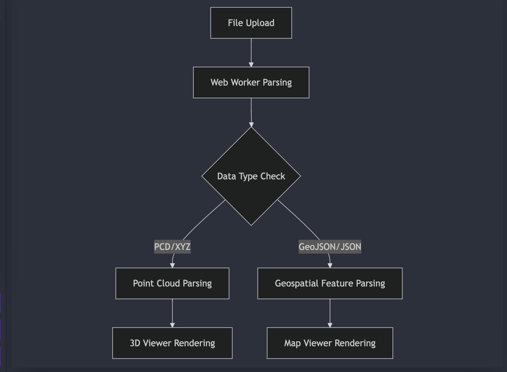

# Local Deployment Guide

## 1. Prerequisites
```bash
# System Requirements
- Node.js v16+
- npm v8+ or yarn 1.22+
- WebGL 2.0 capable browser(IE and Opera Mini not support)

# Verify environment
node --version
npm --version
```


## 2. Installation Steps
```bash
# Clone repository
git clone https://github.com/Breten6/3DViewer/
cd point-cloud-viewer

# Install dependencies
npm install

# Or using yarn
yarn install
```


## 3. Configuration
```javascript:point-cloud-viewer/.env
# Environment Variables
PORT=3000                 # server port
```

## 4. Development Mode
```bash
# Start development server
npm start

# Visit URL
http://localhost:3000/
```

## 7. Prepare Testing Dataset

1. Visit https://www.dropbox.com/scl/fi/uqazu1ipdp0ulcihm7cit/dataset.zip?rlkey=o6smsbnhod9z4szifyqfg1ev5&st=d1xj4e7b&dl=0

2. Download <dataset.zip>, decompress it.

3. Use data in <threed> fold to test 3d Point Cloud

4. Use data in <gis> fold to test GIS Viewer

    - Use "TimeSeries" prefixed data to test time-series tnimation 

## 8. Troubleshooting

### FAQ 1: WebGL cannot be initialized
` ` `
Solution:
1. Check your browser support: Visit https://get.webgl.org/ and https://caniuse.com/webgl2
2. Update the graphics card driver
3. Add parameters when starting Chrome:
chrome --use-angle=gl-egl --ignore-gpu-blocklist
` ` `

### Common problem 2: Large file parsing failure

Tens of millions point size 3d point cloud files and GIS files larger than 50mb may not parse and render correctly. This is a known issue, and is actively investigating a permanent fix. In the meantime, please consider splitting large files as a temporary workaround.


# 3D & GIS Viewer Design Document

## 1. System Architecture
- 

## 2. Key Workflows

### 2.1 File Upload & Processing
- 

### 2.2 3D Viewer Camera Control
```
User Interaction → TrackballControls → Camera Matrix Update → Render Loop
Pan: Continuous position updates via button hold
Zoom: via buttons + via mouse wheel
```

### 2.3 GIS Filter Workflow
```
GeoJSON Data → Flatten Props → Apply Filters (Time/Geometry/Properties) →
Supercluster → Render Markers/Clusters
```

## 3. Core Features

### 3.1 3D Viewer
- Camera Controls:
  - 360 degree rotation
  - Programmatic pan (arrow buttons)
  - Zoom in/out (buttons + wheel)
  - Reset view
  - 1e8 meters valid camera range
- Point Cloud Rendering:
  - Height based color mode
  - Dynamic point size control
  - Bounding box calculation
  - Screenshot capture
  - Real point size adjustment range calculation
  - Dynamic Point size adjustment
    - 

### 3.2 GIS Viewer
- Time Series Animation:
  - Slider-based timeline
  - Auto-play/pause
  - Time filtering
- Advanced Filtering:
  - Geometry type filters
  - Property filters (nested/flattened)
- Cluster Visualization:
  - Supercluster-based aggregation
  - Paginated popup content
  - Dynamic cluster sizing

## 4. Performance Optimization

### 4.1 Web Worker Architecture
- File parsing offloaded to worker
- LZF decompression in worker
- Progress reporting system
- Transferable objects for binary data
- 

### 4.2 WebGL Optimization
- BufferGeometry for efficient rendering
- Frustum culling
- Size-attenuated points
- Single draw calls for point clouds

### 4.3 GIS Optimization
- Supercluster for real-time clustering
- Memoized filtering (useMemo)
- Layer recycling with cleanup
- Viewport-based rendering

### 4.4 Performance Metrics  
| Metric                  | Target      | Measurement Method       |  
|-------------------------|-------------|---------------------------|  
| Initialization Time     | ≤3s         | Million-points dataset : Chrome Performance  |  
| Frame Rate (3D)         | ≥30 FPS     | Million-points dataset : Chrome Performance  | 
| Map Update Latency      | <100ms      | Greenbelt_designation data 20MB : Chrome Performance   |  
| Map filter Latency      | <500ms      | Greenbelt_designation data 20MB : Chrome Performance   |  

## 5. Memory Management

1. Three.js Object Recycling:
```javascript
scene.remove(oldPointCloud);
oldPointCloud.geometry.dispose();
oldPointCloud.material.dispose();
```

2. GIS Data Handling:
- Feature flattening for filtering
- Cluster lifecycle management
- Layer registry for cleanup

3. Web Worker Memory:
- ArrayBuffer transfer rather than copy
- Manage the worker lifecycle explicitly

4. Outcome
- Chrome memory snapshots show a memory cleanup rate > 95% during point cloud switching

## 6. UI Design System

### 6.1 Loading & Progress
- Linear progress bar for file uploads
- Percentage-based updates
- Loading states for 3D rendering

### 6.2 Filter Hierarchy
- Filtering with Multi-select Dropdown Menue
```
Geometry Filter → Flattened Properties →  Key Selection
                                              └─ Value Multi-select
```
- Memorized filter selections with deletable cards

### 6.3 GIS Points Cluster
- Apply Supercluster to avoid overlapping points markers
- Merge points' popup, paginated popup content to avoid overflow

### 6.4 Information Panel
- File metadata table
- Bounding box visualization
- Point cloud statistics 
- Error/warning notifications

## 7. Key Technical Decisions

1. **Data Processing**:
- Binary compressed format support (PCD)
- Avoid overlapping points markers using Supercluster
- Flatten nested properties for filter performance

2. **Rendering**:
- Three.js for WebGL acceleration
- Leaflet with custom cluster rendering

3. **State Management**:
- Component-local state for viewer controls
- Memoized selectors for filtered data
- Ref-based access to Three.js objects
